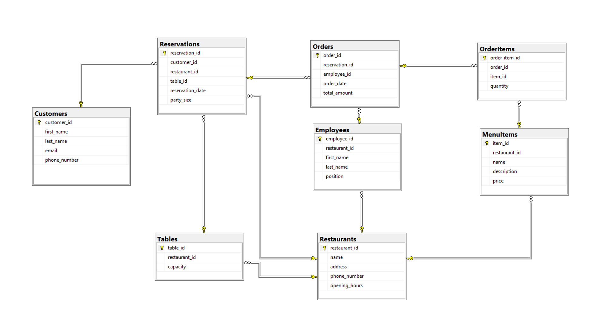

# Restaurant Reservation System - Project Overview

## Introduction

Welcome to the Restaurant Reservation System project! This repository contains a comprehensive system for managing restaurant reservations, customer data, and restaurant details. To get started, let's break down the project requirements and understand what needs to be accomplished.

## Project Requirements

### Prerequisites

- **.NET Core 5.0+**: Ensure that you have .NET Core 5.0 or higher installed.
- **Git Best Practices**: Follow Git best practices for version control and host your project on GitHub. Commit and push your changes to GitHub at the end of each phase with meaningful commit messages describing what you have implemented in each commit.

### Database Schema

Before we dive into the tasks, let's familiarize ourselves with the database schema. The schema is the foundation of the system, consisting of tables that represent restaurant reservations, customer data, and restaurant information. Here's an overview of the database schema:

### Project Setup

1. **Database Creation**:
    - Create a SQL Server database named **`RestaurantReservationCore`** using SQL Server Management Studio (SSMS).

2. **Project Setup**:
    - Create a console application project named **`RestaurantReservation`**.
    - Create a library project named **`RestaurantReservation.Db`** and reference it from the **`RestaurantReservation`** project.

### Data Models

- Create data models for the tables defined in the database schema. Ensure that the models include all necessary keys, relationships, constraints, and navigations. These models should be placed in the **`RestaurantReservation.Db`** project.

### Migrations and Seeding

- Write migrations to create the tables specified in the database schema. The migration files should reside in the **`RestaurantReservation.Db`** project.
- Populate the tables with at least **5 records** in each.

### Functionality Demonstration

- In the **`RestaurantReservation`** console application, demonstrate the functionality of all the methods you will create by calling them with sample data for testing purposes.

### CRUD Operations

- Implement `Create`, `Update`, and `Delete` methods for each entity.

### Additional Methods

- Implement the following methods:
  1. `**ListManagers()**`: Retrieve all employees who hold the position of "Manager."
  2. `**GetReservationsByCustomer(CustomerId)**`: Retrieve a list of reservations made by a specific customer, taking the customer's identifier as a parameter.
  3. `**ListOrdersAndMenuItems(ReservationId)**`: List orders placed on a specific reservation along with the associated menu items, taking the reservation identifier as a parameter.
  4. `**ListOrderedMenuItems(ReservationId)**`: Find the menu items ordered in a specific reservation by providing the reservation identifier.
  5. `**CalculateAverageOrderAmount(EmployeeId)**`: Calculate the average order amount for a specific employee using their identifier.

### Views

- Utilize Entity Framework Core to query a database view that lists all the reservations with their associated customer and restaurant information.
- Create a query to retrieve employees with their respective restaurant details from a database view.

### Database Functions

- Create a database function to calculate the total revenue generated by a specific restaurant using Entity Framework Core migrations.
- Implement the function call in your **`RestaurantReservation.Db`** project, making it accessible from your application.

### Stored Procedures

- Design a stored procedure to find all customers who have made reservations with a party size greater than a certain value using Entity Framework Core migrations.
- Develop a method in your **`RestaurantReservation.Db`** project to execute the stored procedure.

### Repository Classes

- Create a repository class for each entity and name it as follows: **`{EntityName}Repository.cs**`.
- Organize related methods from the previous requirements into the appropriate repository classes.
- These repository classes should be located in the **`Repositories`** folder within the **`RestaurantReservation.Db`** project.

## Contributors

- Ibrahim Nobani

## License

This project is licensed under the MIT License.